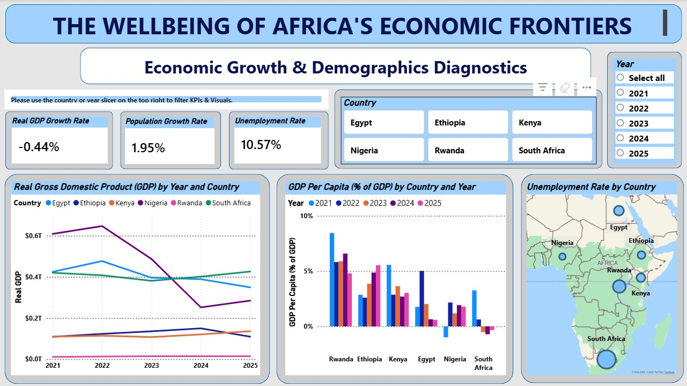
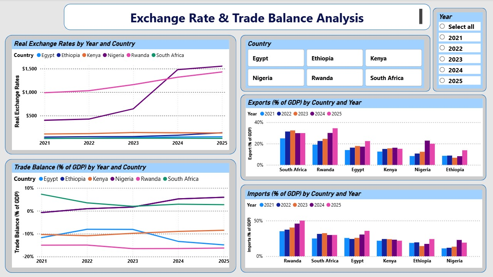
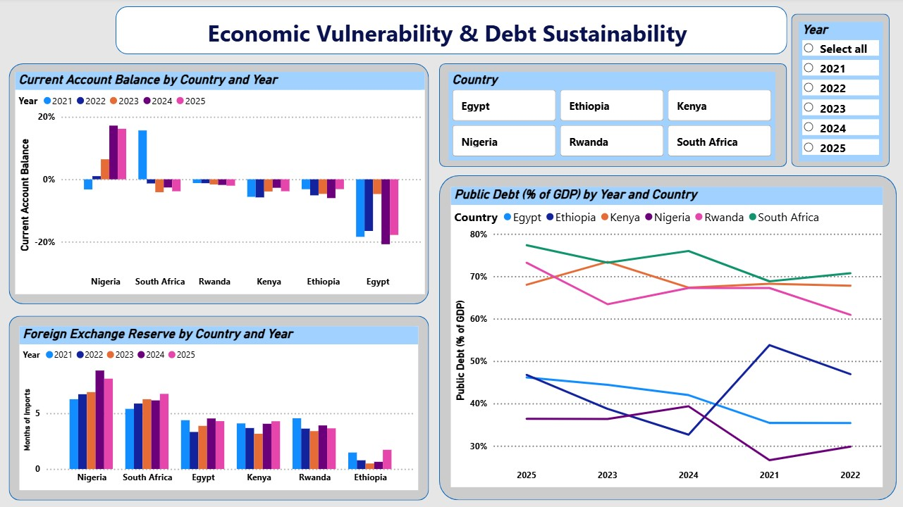

# Macroeconomic-Intelligence-Dashboard-on-Africa-s-Frontier-Economies-2021-2025

## Overview

This is an interactive macroeconomic dashboard analyzing six African frontier economies — Kenya, Egypt, Ethiopia, Nigeria, Rwanda, and South Africa.

Using World Bank and IMF data, the dashboard evaluates growth performance, monetary policy credibility, external sector stability, and debt sustainability. The objective is to assess macroeconomic resilience through an integrated analytical framework rather than isolated indicators.

---

## Key Performance Indicators (KPIs)

The dashboard tracks and computes the following KPIs using DAX measures:
- Real Gross Domestic Product (GDP)  
- GDP Growth Rate
- GDP Per Capita  
- Population Growth Rate  
- Unemployment Rate
- Real Exchange Rate  
- Trade Balance
- Exports (% of GDP)
- Imports (% of GDP)
- Inflation Rate  
- Real Interest Rate  
- Money Supply (% of GDP)  
- Monetary Policy Stance  
- Monetary Policy Effectiveness Ratio  
- Inflation Volatility  
- Current Account Balance  
- Foreign Exchange Reserves (Import Cover)  
- Public Debt (% of GDP)

---

## Dimensional Analysis

The data model follows a structured star schema approach to ensure clean aggregation and scalable analytics:

- **Fact Table:** Macroeconomic indicators  
- **Dimension Tables:** Country, Year, Indicator  

Dynamic filtering is enabled across:
- Country  
- Year  
- Indicator Category  
- Macroeconomic Themes (Growth, Monetary, External, Debt)  

This structure ensures accurate DAX-driven KPI calculations and reliable cross-country comparisons.

---

## Key Insights

- Growth performance varies significantly across economies, with external imbalances constraining sustainability in some cases.  
- Persistent trade deficits and exchange rate depreciation amplify inflationary pressures.  
- Real interest rates provide a more accurate signal of monetary stance than nominal rates.  
- Inflation volatility reveals differences in policy credibility.  
- Rising public debt combined with low reserve buffers increases external vulnerability in certain economies.  

The dashboard demonstrates how macroeconomic variables interact rather than operate independently.

---

## Tools & Technologies

- **Power BI** – Data modeling, dashboard development, visualization  
- **DAX (Data Analysis Expressions)** – KPI creation and macroeconomic calculations  
- **Microsoft Excel** – Data cleaning and transformation  
- **World Bank Open Data & IMF Data** – Primary data sources  

---

## How to Use

1. Download and open the Power BI `.pbix` file.
2. Use the Country and Year slicers to dynamically filter analysis.
3. Navigate across the four thematic pages:
   - Economic Growth & Demographics Diagnostics
   - Trade Analysis
   - Monetary Policy Analysis
   - Economic Vulnerability & Debt Sustainability
4. Review the attached PDF report for detailed narrative interpretation.
5. Refer to the dashboard snapshots included in this repository for a visual and interactive preview.

---

### Dashboard Preview






---

```
## Repository Structure

Macroeconomic-Intelligence-Dashboard-on-Africa-s-Frontier-Economies-2021-2025
│
├── README.md
├── Dashboard/
│ └── The_Wellbeing_of_Africa's_Frontier_Economies.pbix
│
├── Images/
│ ├── growth_page.png
│ ├── trade_page.png
│ ├── monetary_page.png
│ └── vulnerability_page.png
│
└── Report/
└── Macroeconomic_Report.pdf
```
---
## Project Objective

This project showcases applied macroeconomic analysis and data storytelling using Power BI. It highlights how quantitative tools cab be used in a comparative assessment of the economic resilience, monetary policy credibility, and debt sustainability of African frontier markets.

---

## Contact

If you would like to discuss macroeconomic modeling, policy research, or data analytics collaboration, feel free to connect via LinkedIn.


